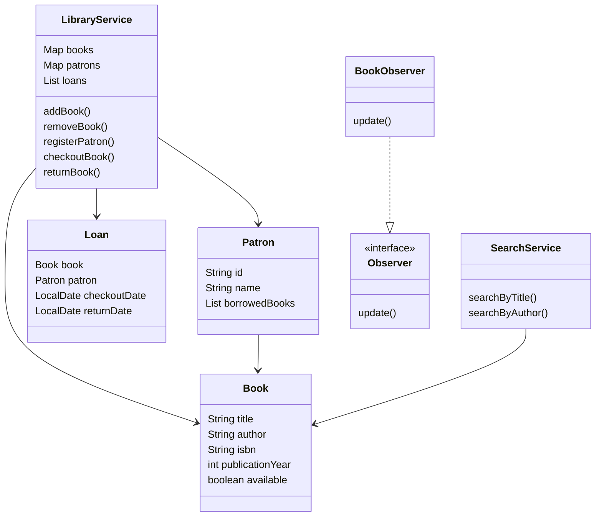

# Library Management System

## Overview

This project implements a **Library Management System in Java** that helps librarians manage books, patrons, and lending processes efficiently.

The system demonstrates the use of **Object-Oriented Programming (OOP)** concepts, **SOLID principles**, **Java Collections**, and **Design Patterns**.

This project focuses on **clean code design and modular architecture**.

---

# Features

## Book Management

* Add new books to the library
* Remove books from the inventory
* Search books by title or author
* Maintain book availability status

## Patron Management

* Register new patrons
* Track borrowed books for each patron
* Maintain patron borrowing history

## Lending Process

* Checkout books to patrons
* Return borrowed books
* Track loan records

## Inventory Management

* Track available books
* Track borrowed books
* Maintain library catalog

---

# Technologies Used

* Java
* Java Collections Framework
* Object-Oriented Programming (OOP)

Data structures used:

* HashMap
* ArrayList
* List
* Map

---

# OOP Concepts Used

## Encapsulation

Private attributes with getters and setters.

Example:

* `Book`
* `Patron`

## Abstraction

Service classes handle business logic.

Example:

* `LibraryService`
* `SearchService`

## Polymorphism

Observer interface allows multiple implementations.

## Inheritance

Design patterns utilize interface inheritance.

---

# Design Patterns Used

## Observer Pattern

Used to notify patrons when a book becomes available.

Classes involved:

* `Observer`
* `BookObserver`

This pattern allows multiple observers to be notified when the state of a book changes.

---

# Project Structure

```
Library-Management-System
│
├── src
│   ├── model
│   │   ├── Book.java
│   │   ├── Loan.java
│   │   └── Patron.java
│   │
│   ├── service
│   │   ├── LibraryService.java
│   │   └── SearchService.java
│   │
│   ├── pattern
│   │   ├── Observer.java
│   │   └── BookObserver.java
│   │
│   └── Main.java
│
├── README.md
└── .gitignore
```

---

# UML Class Diagram



---

# How to Run the Project

## 1 Clone the Repository

```
git clone https://github.com/Yashaswini0407/Library-Management-System
```

## 2 Navigate to Project Folder

```
cd Library-Management-System
```

## 3 Compile the Project

```
javac src/Main.java
```

## 4 Run the Program

```
java src/Main
```

---

# Example Workflow

1. Add books to the library
2. Register patrons
3. Checkout books
4. Return books
5. Search books in the catalog

---

# Author

**Yashaswini N**

GitHub Profile
https://github.com/Yashaswini0407
